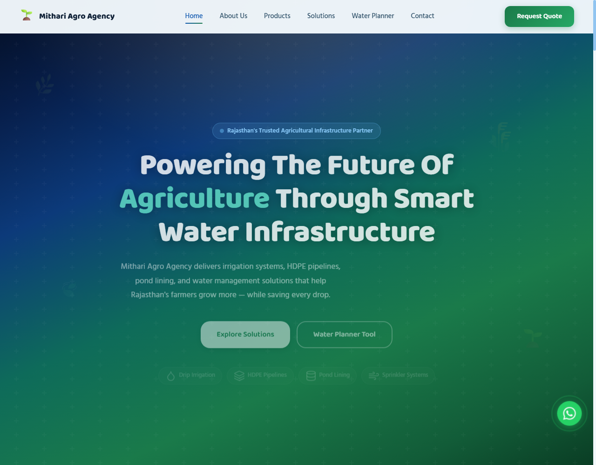
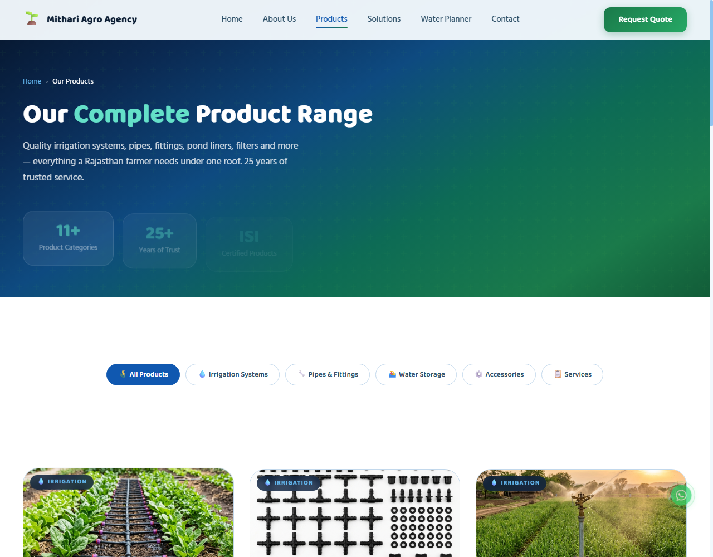
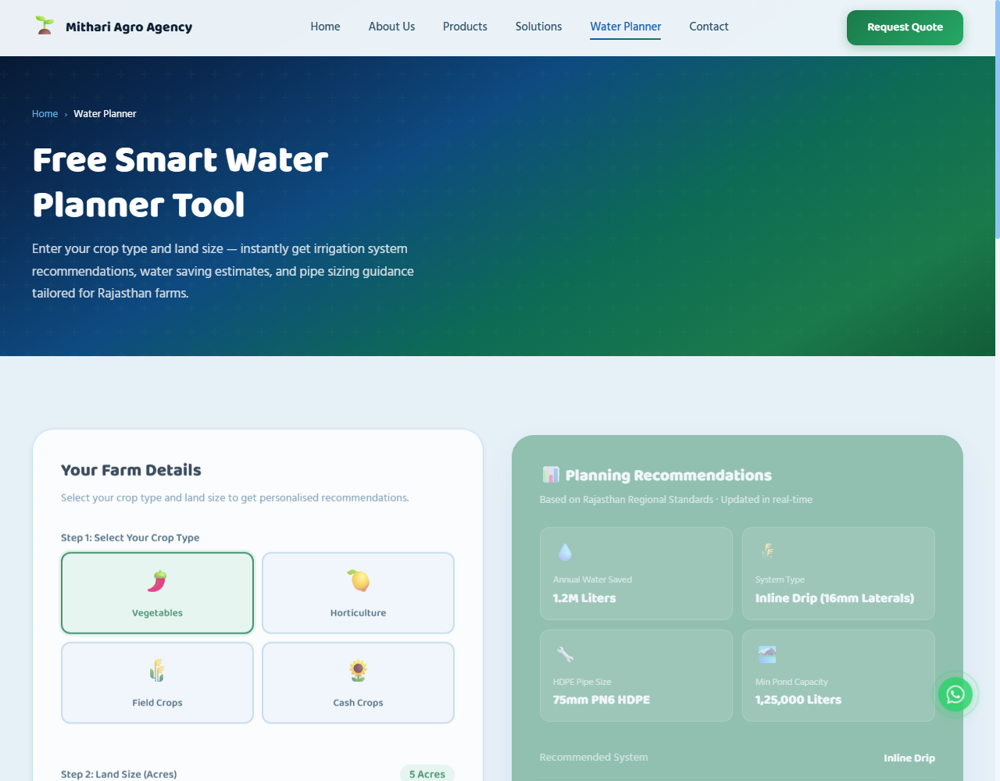
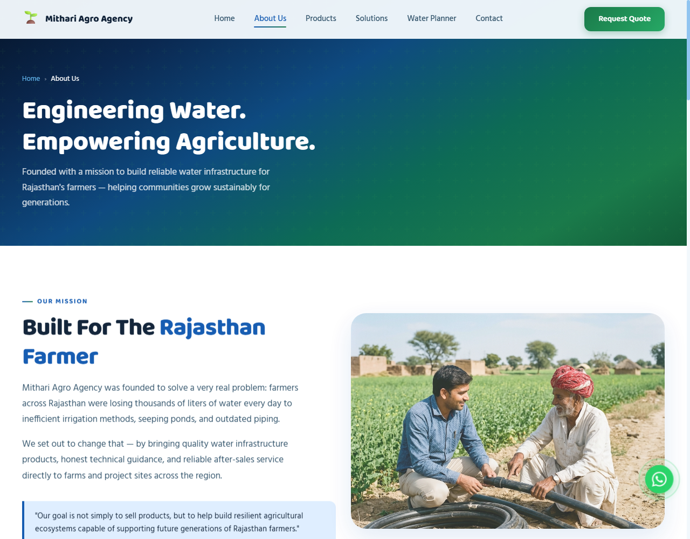
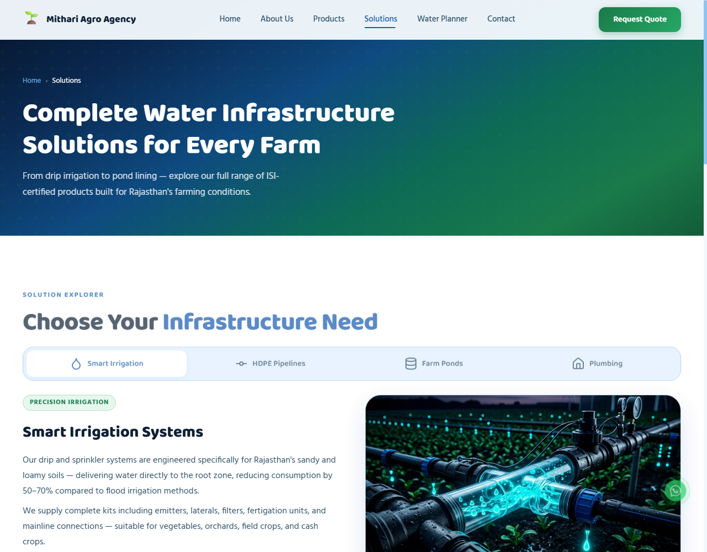
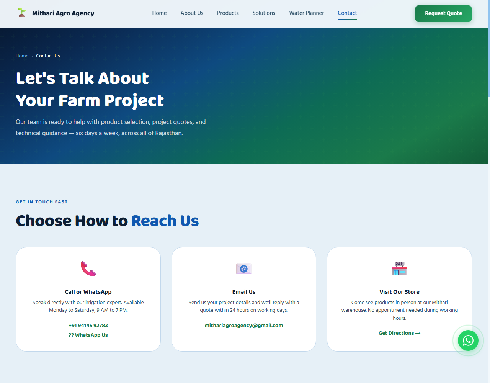

# Mithari Agro Agency Website

[](#)
[](#)
[](#)

A beautiful, responsive, and farmer-friendly multi-page website built for **Mithari Agro Agency**, one of Mithari's (Rajasthan) most trusted names in agricultural irrigation systems, water management, and piping infrastructure.

The website is designed with a premium, clean aesthetic using a curated **Deep Navy Blue, Sky Blue, and Forest Green** color scheme, high-quality typography (Baloo 2 + Hind), custom animations, and interactive tools specifically built to serve farmers, contractors, and local customers.

---

## 📸 Website Preview & Screenshots

### 🏠 Home Page
*Features a clean intro, trust indicators, high-quality irrigation galleries, a client testimonials carousel, and an embedded interactive Google Map.*


### 📦 Product Showcase
*Displays all 11 core product categories with instant category filters and quick-action WhatsApp buttons.*


### 🧮 Interactive Water Planner
*A custom utility allowing farmers to input crop area and select irrigation methods to estimate water needs, number of drippers/sprinklers, and recommended solutions.*


### 🏢 About & Legacy
*Chronicles the 25-year history of Mithari Agro Agency, highlighting the founders and manager.*


### 🛠️ Solutions & Consultancy
*Details the tailored field setups and expert consultancy offered by the agency.*


### 📞 Contact & Directions
*Contains clear contact details, direct WhatsApp links, and an interactive Google Maps embed for easy directions.*


---

## ✨ Features

1. **Interactive Water Planner**:
   - A calculator designed to estimate water requirements in liters.
   - Calculates the quantity of drippers or sprinklers required based on field area (in bighas or acres).
   - Generates immediate recommendations.
2. **Product Showcase & Filters**:
   - Covers 11 primary product categories with dynamic filtering tabs.
   - Each product has a direct **WhatsApp Inquiry Button** pre-filled with Hinglish/Hindi text (e.g. asking for price quotes and availability of CPVC/HDPE pipe dimensions).
3. **Seamless Mobile-Friendly Design**:
   - Fully responsive grid layout adapting perfectly to screens from mobile phones to desktops.
   - Elegant custom sliding sidebar navigation on mobile.
4. **Enhanced UX & Interactivity**:
   - Floating WhatsApp button for instant customer service.
   - Dynamic custom cursor ring animation and micro-interactions.
   - Smooth scroll behavior and accordions for FAQs.
5. **Interactive Directions**:
   - Real, embedded Google Maps iframe showing the exact location of the agency on Didwana Road, Mithari.

---

## 🛠️ Tech Stack

- **Markup & Structure**: HTML5 (Semantic elements)
- **Styling & Design System**: Vanilla CSS3 (CSS Variables for typography, sizing, and colors; Custom responsive grids, animations, and transitions)
- **Logic & Interactions**: Vanilla JavaScript (ES6+)
- **Icons**: Inline SVGs and Lucide Icons

---

## 📦 Core Product Lineup

1. **Drip Irrigation System** (ड्रिप सिंचाई प्रणाली)
2. **Drip Irrigation Fittings** (ड्रिप फिटिंग्स)
3. **Sprinkler Irrigation System** (फव्वारा सिंचाई प्रणाली)
4. **Rain Pipe System** (रेन पाइप प्रणाली)
5. **HDPE Pipes & Fittings** (एचडीपीई पाइप और फिटिंग्स)
6. **CPVC Pipes & Fittings (Prince)** (सीपीवीसी पाइप और फिटिंग्स)
7. **SWR Pipes & Fittings** (एसडब्ल्यूआर पाइप और फिटिंग्स)
8. **Pond Tirpal / Pond Liner** (तालाब तिरपाल / पॉन्ड लाइनर)
9. **Filters & Filtration Systems** (फ़िल्टर और फ़िल्टरिंग सिस्टम)
10. **Valves & Accessories** (वाल्व और सहायक उपकरण)
11. **Irrigation Consultancy & Solutions** (सिंचाई परामर्श और समाधान)

---

## 🚀 How to Run Locally

Since this is a static website, you do not need complex installation steps.

1. **Clone the Repository**:
   ```bash
   git clone https://github.com/harshjn01/Mithari-Agro-Agency-Website.git
   cd Mithari-Agro-Agency-Website
   ```

2. **Serve the Files**:
   You can open `index.html` directly in any web browser. However, to ensure all features (like interactive maps and icons) resolve perfectly, it is recommended to run a simple HTTP server:
   
   - **Using Python**:
     ```bash
     python -m http.server 3000
     ```
     Open `http://localhost:3000` in your web browser.
     
   - **Using Node.js (`serve`)**:
     ```bash
     npx serve -p 3000
     ```

---

## 📞 Contact Information

For inquiries, support, or pricing, reach out directly or visit our shop:

- **Founder**: Dharam Chand Jain (धरम चंद जैन) - 📞 [+91 9414592783](tel:+919414592783)
- **Manager**: Jagdish Kumawat (जगदीश कुमावत) - 📞 [+91 7425837786](tel:+917425837786)
- **Email**: [mithariagroagency@gmail.com](mailto:mithariagroagency@gmail.com)
- **Address**: Didwana Road, Mithari, Didwana-Kuchaman District, Rajasthan - 341506
- **Google Maps Store Location**: [Mithari Agro Agency on Google Maps](https://maps.app.goo.gl/yQW2XgD2hVpG8mQ87)
